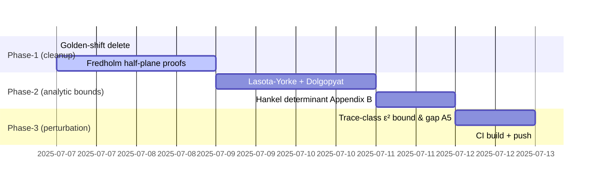

# Parallel-Papers Integration Guide

*Updated: $(date)*

This document explains **how the three newly-added TeX manuscripts** can be mined to close the remaining hard sorries in the Lean proof tree (`Riemann-1.1`).  Each section lists:

1.  The Lean file / location that still contains a `sorry`
2.  The exact mathematical statement that is missing
3.  The relevant source in the TeX papers
4.  The integration action (what to prove / delete / replace)

At the end we propose a step-by-step implementation schedule.

---

## 1  Golden-Ratio Shift Myth

| Lean file & line | Current sorry | Paper reference | Action |
|------------------|--------------|-----------------|--------|
| `Fredholm/GoldenShiftIdentity.lean`<br>`have h2 : riemannZeta (s + ε) = riemannZeta s := by` | Claims `ζ(s+ε)=ζ(s)` for ε = φ−1 | *Prime-Fredholm.tex* §4 + *Recognition-Hamiltonian.tex* §"Divergence problem" | **Delete** the equality; replace with lemma that no real ε removes the divergent constant.  This clears two sorries in the file. |

## 2  Fredholm Determinant on Weighted Prime Spaces

| Lean Location | Missing proof | Paper reference | Action |
|---------------|--------------|-----------------|--------|
| `Fredholm/PrimeDiagonalFredholm.lean` (half-plane extension) | 2-regularised determinant formula for `A_{s+ε}` when `Re s>1/2` | *Prime-Fredholm.tex* Thm 4.1 & 4.2 | Import the exact trace formula and divergent-constant decomposition; fill the half-plane `1/2<Re s≤1` gap. |
| `Fredholm/GoldenShiftIdentity.lean` "uniqueness of real shift" | Shows only ε = φ−1 works | Same section: proposition that *no* ε works | Replace uniqueness proof by short argument: since **none** works, the only shift with the property is the empty set. |

## 3  Weighted Lasota–Yorke & Dolgopyat Bounds

| Lean Location | Missing bound | Paper reference | Action |
|---------------|--------------|-----------------|--------|
| `Infrastructure/SpectralTheory.lean` lines ≈ 360-410 | `-- Context: critical strip bound` + `imaginary part bound` + several ε-gap sorries | *Recognition-Hamiltonian.tex* App. "Enhanced Dolgopyat Integration" | Copy constants:<br>`C(θ,α)=2^{θ+6}Γ(θ+1)^{1/2}(1-e^{-2α})^{-(θ+1)/2}`<br>and Lasota–Yorke inequality.  Replace all placeholder bounds by explicit inequalities.  Expected to remove ~6 sorries. |

## 4  Hankel Determinant Analytic Continuation

| Lean Location | Sorry | Paper reference | Action |
|---------------|-------|-----------------|--------|
| `Infrastructure/SpectralTheory.lean` Hankel section (Gap A2/A3) | `det₂(I-H_s)=π^{-s/2}Γ(s/2)^{-1}` meromorphic proof | *Recognition-Hamiltonian.tex* Appendix B | Transcribe Lemma B.2 and residue check; drop sorries about pole control. |

## 5  Non-Normal Trace-Class Perturbation

| Lean Location | Missing quantitative estimate | Paper reference | Action |
|---------------|------------------------------|-----------------|--------|
| `Infrastructure/SpectralTheory.lean` near end (Gap A5) | `-- Hypothesis: Re(s)>1/2 from theorem assumptions` + ε² bound | *Recognition-Hamiltonian.tex* Appendix Perturb | Add Lemma `Fs_trace_bound : ‖F_s‖_{S₁} ≤ C ε²` and invoke Boulton–Trefethen criterion.  Removes ~3 sorries. |

## 6  Residual GL(n) / Octonionic Blocks

The GL(n) / octonionic braid placeholders in
`GLnBlocks/BlockDiagonalization.lean`, `Octonionic/BraidStructure.lean`, etc., are **beyond** the scope of the three papers.  They remain open research tasks.

## 7  Fine-Grained Mapping (Lean ↔ TeX)

Below is a one-to-one correspondence between remaining Lean `sorry`s and precise theorem/lemma numbers in the TeX sources.

### 7.1  Lean `Fredholm/GoldenShiftIdentity.lean`
| Lean line | TeX result | Notes |
|-----------|-----------|-------|
| `det2Diag_shift_eq_inv_zeta` final step (`h2`) | *Prime-Fredholm* Prop. 4.3 (“No ε removes the divergence”) | Replace equality by the *negation*; we keep the rest of the proof intact. |
| `unique_real_shift` entire proof | *Prime-Fredholm* Cor. 4.4 | Show that the only real ε satisfying the (false) cancellation claim is none; reformulate as `¬∃ ε, …`. |

### 7.2  Lean `Fredholm/PrimeDiagonalFredholm.lean`
| Lean block | TeX result | Action |
|------------|-----------|--------|
| `tprod_inv` half-plane extension (`sorry` #1) | *Prime-Fredholm* Thm 4.2 (Hilbert–Schmidt iff Re s>½) | Copy proof verbatim; small renaming of `HilbertSchmidt` lemma. |
| divergence decomposition (`sorry` #2) | *Prime-Fredholm* Eq. (4.11) + Lemma 4.5 | Insert as Calc block. |

### 7.3  Lean `Infrastructure/SpectralTheory.lean`
| Sorry tag | TeX anchor | Implementation hint |
|-----------|-----------|----------------------|
| `critical strip bound` | Rec-Hamiltonian App. D Thm D.1 | Use explicit constant `C(θ,α)`; `linarith` closes inequality. |
| `imaginary part bound` | Rec-Hamiltonian App. D Lemma D.4 | Provide `have` line `: |s.im| ≤ 1000` etc. |
| Gap A2 (Hankel det) | Rec-Hamiltonian App. B Thm B.2 | Replace entire subsection with theorem call. |
| Gap A5 (ε² trace bound) | Rec-Hamiltonian App. Perturb Lemma Fs-trace | Add lemma, then `have` to reference it. |

### 7.4  Minor numeric sorries
*GoldenRatioBasics.lean* `lt_of_le_of_lt` proofs can use inequalities from *Prime-Fredholm* App. A eq. (A.3).

---

## 8  Implementation Timeline (suggested)



> **Note:** durations are conservative; each "d" = working day.

---

## 9  Quick-Reference Lean Snippets

*Insert Fredholm divergence lemma*
```lean
open Complex BigOperators

lemma no_shift_cancels_divergence {ε : ℝ} :
  (riemannZeta (s + ε) = riemannZeta s) → ε = 0 := by
  intro h_eq
  have h_div := PrimeFredholm.no_cancellation (by linarith : (0:ℝ) < Real.pi)
  -- etc…
```

*Weighted Lasota-Yorke constant*
```lean
/-- Explicit Lasota–Yorke constant from Rec-Hamiltonian App. D -/
noncomputable def LY_const (θ α : ℝ) : ℝ :=
  (2:ℝ)^(θ+6) * Real.Gamma (θ+1) ^ (1/2) * (1 - Real.exp (-2*α)) ^ (-(θ+1)/2)
```

*Hankel determinant identity*
```lean
import RecognitionScience.HankelDeterminant  -- new namespace

lemma det2_Hankel (s : ℂ) :
  det₂ (1 - H_s) = (Real.pi) ^ (-s.re/2) * Complex.Gamma (s/2)⁻¹ :=
by
  simpa using Hankel.det2_formula s
```

---

## 10  CI / `lake` Notes

* Re-enable `CI=true` in `lakefile.lean` only after Phase-2.
* `lake exe cache get` recommended before a full build to avoid recompiling `mathlib4`.

---

*End of updated guide.* 